# C Programming: A Modern Approach
## Complete Self-Learned Solutions and Implementation Repository

<div align="center">
  
  
  
  
</div>

**Author:** Naman   
**Course:** Independent Study  
**Textbook:** K.N. King, *C Programming: A Modern Approach*, 2nd Edition  
**Academic Year:** 2025-2026

## Copyright, Licensing & Academic Integrity

**Book Source Code Notice:**  
Code adapted or referenced directly from the textbook retains the copyright notice as stated in `book-notice.txt` (originally provided with the book's supplemental materials by K.N. King). Please ensure compliance with the original author's copyright.

**Repository License:**  
This project's original code and documentation are licensed under a [Creative Commons Attribution-NonCommercial-ShareAlike 4.0 International License (CC BY-NC-SA 4.0)](https://creativecommons.org/licenses/by-nc-sa/4.0/). See the [LICENSE](LICENSE) file for more information.

> [!WARNING]
> **Educational Use Statement:**
> Solutions are provided for educational reference only. Direct copying for coursework violates academic integrity standards. If you are a student in a course using this textbook, please consult your institution's academic integrity policies before referencing these solutions. Users are encouraged to understand the logic and implement their own solutions.

---

## Acknowledgments

**Gratitude is extended to:**

- **K.N. King** for authoring an exceptionally comprehensive and pedagogically sound textbook
- **Dennis Ritchie and Brian Kernighan** for creating the C programming language and establishing its foundations
- **The open-source community** for maintaining excellent development tools and documentation

---

## Table of Contents

1. [Project Overview](#project-overview)
2. [Repository Architecture](#repository-architecture)
3. [Implementation Standards](#implementation-standards)
4. [Build System](#build-system)
5. [Chapter Progress](#chapter-progress)
6. [Pedagogical Approach](#pedagogical-approach)
7. [Technical Specifications](#technical-specifications)
8. [Development Workflow](#development-workflow)
9. [References and Resources](#references-and-resources)

---

## Project Overview

This repository represents a systematic, chapter-by-chapter implementation of all exercises, examples, and programming projects from K.N. King's definitive textbook on C programming. The work demonstrates comprehensive engagement with fundamental through advanced concepts in the C programming language, following modern software engineering practices and academic rigor.

### Objectives

**Primary Goals:**
- Master C programming fundamentals and advanced concepts through deliberate practice
- Develop proficiency in low-level systems programming and memory management
- Build a comprehensive reference library of C programming solutions
- Demonstrate code quality, documentation standards, and professional development practices

**Learning Outcomes:**
- Deep understanding of C language syntax, semantics, and idioms
- Proficiency in pointer arithmetic, dynamic memory allocation, and data structures
- Experience with compilation toolchains, debugging, and performance optimization
- Development of clean, maintainable, and efficient code

---

## Repository Architecture

```mermaid
graph TD;
    Root["📂 C-Programming-Modern-Approach"] --> P1["📚 Part I: Basic Features (Ch 1-10)"];
    Root --> P2["📚 Part II: Advanced Features (Ch 11-17)"];
    Root --> P3["📚 Part III: Standard Library (Ch 18-27)"];
    
    P1 --> Ch2["📁 Chapter-XX-*"];
    
    Ch2 --> Ex["📂 examples/"];
    Ch2 --> Exc["📂 exercises/"];
    Ch2 --> Proj["📂 projects/"];
    
    classDef folder fill:transparent,stroke:#333,stroke-width:2px;
    class Root,P1,P2,P3,Ch2,Ex,Exc,Proj folder;
```



### Directory Structure

<details open>
<summary><strong>📂 Root Directory</strong></summary>
```
C-Programming-Modern-Approach/
│
├── 📄 README.md
├── 📄 LICENSE
├── 📄 .gitignore
```
</details>
<details>
<summary><strong>📚 Part I: Basic Features of C (Chapters 1-10)</strong></summary>
<details>
<summary>&nbsp;&nbsp;&nbsp;&nbsp;📁 Chapter-01-Introducing-C</summary>
```
Chapter-01-Introducing-C/
├── 📘 README.md
├── 📂 examples/
│   ├── example_01.c
│   └── example_02.c
├── 📂 exercises/
│   ├── exercise_01.c
│   ├── exercise_02.c
│   ├── exercise_03.c
│   └── exercise_04.c
└── 📂 projects/
    └── project_01.c
```
</details>
<details>
<summary>&nbsp;&nbsp;&nbsp;&nbsp;📁 Chapter-02-C-Fundamentals</summary>
```
Chapter-02-C-Fundamentals/
├── 📘 README.md
├── 📂 examples/
│   ├── example_01.c ... example_08.c
├── 📂 exercises/
│   ├── exercise_01.c ... exercise_14.c
└── 📂 projects/
    ├── project_01.c ... project_08.c
```
</details>
<details>
<summary>&nbsp;&nbsp;&nbsp;&nbsp;📁 Chapter-03-Formatted-Input-Output</summary>
```
Chapter-03-Formatted-Input-Output/
├── 📘 README.md
├── 📂 examples/
│   ├── example_01.c ... example_06.c
├── 📂 exercises/
│   ├── exercise_01.c ... exercise_06.c
└── 📂 projects/
    ├── project_01.c ... project_06.c
```
</details>
<details>
<summary>&nbsp;&nbsp;&nbsp;&nbsp;📁 Chapter-04-Expressions</summary>
```
Chapter-04-Expressions/
├── 📘 README.md
├── 📂 examples/
├── 📂 exercises/
└── 📂 projects/
```
</details>
<details>
<summary>&nbsp;&nbsp;&nbsp;&nbsp;📁 Chapter-05-Selection-Statements</summary>
```
Chapter-05-Selection-Statements/
├── 📘 README.md
├── 📂 examples/
├── 📂 exercises/
└── 📂 projects/
```
</details>
<details>
<summary>&nbsp;&nbsp;&nbsp;&nbsp;📁 Chapter-06-Loops</summary>
```
Chapter-06-Loops/
├── 📘 README.md
├── 📂 examples/
├── 📂 exercises/
└── 📂 projects/
```
</details>
<details>
<summary>&nbsp;&nbsp;&nbsp;&nbsp;📁 Chapter-07-Basic-Types</summary>
```
Chapter-07-Basic-Types/
├── 📘 README.md
├── 📂 examples/
├── 📂 exercises/
└── 📂 projects/
```
</details>
<details>
<summary>&nbsp;&nbsp;&nbsp;&nbsp;📁 Chapter-08-Arrays</summary>
```
Chapter-08-Arrays/
├── 📘 README.md
├── 📂 examples/
├── 📂 exercises/
└── 📂 projects/
```
</details>
<details>
<summary>&nbsp;&nbsp;&nbsp;&nbsp;📁 Chapter-09-Functions</summary>
```
Chapter-09-Functions/
├── 📘 README.md
├── 📂 examples/
├── 📂 exercises/
└── 📂 projects/
```
</details>
<details>
<summary>&nbsp;&nbsp;&nbsp;&nbsp;📁 Chapter-10-Program-Organization</summary>
```
Chapter-10-Program-Organization/
├── 📘 README.md
├── 📂 examples/
├── 📂 exercises/
└── 📂 projects/
```
</details>
</details>
<details>
<summary><strong>📚 Part II: Advanced Features of C (Chapters 11-17)</strong></summary>
<details>
<summary>&nbsp;&nbsp;&nbsp;&nbsp;📁 Chapter-11-Pointers</summary>
```
Chapter-11-Pointers/
├── 📘 README.md
├── 📂 examples/
├── 📂 exercises/
└── 📂 projects/
```
</details>
<details>
<summary>&nbsp;&nbsp;&nbsp;&nbsp;📁 Chapter-12-Pointers-and-Arrays</summary>
```
Chapter-12-Pointers-and-Arrays/
├── 📘 README.md
├── 📂 examples/
├── 📂 exercises/
└── 📂 projects/
```
</details>
<details>
<summary>&nbsp;&nbsp;&nbsp;&nbsp;📁 Chapter-13-Strings</summary>
```
Chapter-13-Strings/
├── 📘 README.md
├── 📂 examples/
├── 📂 exercises/
└── 📂 projects/
```
</details>
<details>
<summary>&nbsp;&nbsp;&nbsp;&nbsp;📁 Chapter-14-Preprocessor</summary>
```
Chapter-14-Preprocessor/
├── 📘 README.md
├── 📂 examples/
├── 📂 exercises/
└── 📂 projects/
```
</details>
<details>
<summary>&nbsp;&nbsp;&nbsp;&nbsp;📁 Chapter-15-Writing-Large-Programs</summary>
```
Chapter-15-Writing-Large-Programs/
├── 📘 README.md
├── 📂 examples/
├── 📂 exercises/
└── 📂 projects/
```
</details>
<details>
<summary>&nbsp;&nbsp;&nbsp;&nbsp;📁 Chapter-16-Structures-Unions-Enumerations</summary>
```
Chapter-16-Structures-Unions-Enumerations/
├── 📘 README.md
├── 📂 examples/
├── 📂 exercises/
└── 📂 projects/
```
</details>
<details>
<summary>&nbsp;&nbsp;&nbsp;&nbsp;📁 Chapter-17-Advanced-Uses-of-Pointers</summary>
```
Chapter-17-Advanced-Uses-of-Pointers/
├── 📘 README.md
├── 📂 examples/
├── 📂 exercises/
└── 📂 projects/
```
</details>
</details>
<details>
<summary><strong>📚 Part III: The Standard C Library (Chapters 18-27)</strong></summary>
<details>
<summary>&nbsp;&nbsp;&nbsp;&nbsp;📁 Chapter-18-Declarations</summary>
```
Chapter-18-Declarations/
├── 📘 README.md
├── 📂 examples/
├── 📂 exercises/
└── 📂 projects/
```
</details>
<details>
<summary>&nbsp;&nbsp;&nbsp;&nbsp;📁 Chapter-19-Program-Design</summary>
```
Chapter-19-Program-Design/
├── 📘 README.md
├── 📂 examples/
├── 📂 exercises/
└── 📂 projects/
```
</details>
<details>
<summary>&nbsp;&nbsp;&nbsp;&nbsp;📁 Chapter-20-Low-Level-Programming</summary>
```
Chapter-20-Low-Level-Programming/
├── 📘 README.md
├── 📂 examples/
├── 📂 exercises/
└── 📂 projects/
```
</details>
<details>
<summary>&nbsp;&nbsp;&nbsp;&nbsp;📁 Chapter-21-Standard-Library</summary>
```
Chapter-21-Standard-Library/
├── 📘 README.md
├── 📂 examples/
├── 📂 exercises/
└── 📂 projects/
```
</details>
<details>
<summary>&nbsp;&nbsp;&nbsp;&nbsp;📁 Chapter-22-Input-Output</summary>
```
Chapter-22-Input-Output/
├── 📘 README.md
├── 📂 examples/
├── 📂 exercises/
└── 📂 projects/
```
</details>
<details>
<summary>&nbsp;&nbsp;&nbsp;&nbsp;📁 Chapter-23-Library-Support-for-Numbers-and-Character-Data</summary>
```
Chapter-23-Library-Support-for-Numbers-and-Character-Data/
├── 📘 README.md
├── 📂 examples/
├── 📂 exercises/
└── 📂 projects/
```
</details>
<details>
<summary>&nbsp;&nbsp;&nbsp;&nbsp;📁 Chapter-24-Error-Handling</summary>
```
Chapter-24-Error-Handling/
├── 📘 README.md
├── 📂 examples/
├── 📂 exercises/
└── 📂 projects/
```
</details>
<details>
<summary>&nbsp;&nbsp;&nbsp;&nbsp;📁 Chapter-25-International-Features</summary>
```
Chapter-25-International-Features/
├── 📘 README.md
├── 📂 examples/
├── 📂 exercises/
└── 📂 projects/
```
</details>
<details>
<summary>&nbsp;&nbsp;&nbsp;&nbsp;📁 Chapter-26-Miscellaneous-Library-Functions</summary>
```
Chapter-26-Miscellaneous-Library-Functions/
├── 📘 README.md
├── 📂 examples/
├── 📂 exercises/
└── 📂 projects/
```
</details>
<details>
<summary>&nbsp;&nbsp;&nbsp;&nbsp;📁 Chapter-27-Additional-C99-Support</summary>
```
Chapter-27-Additional-C99-Support/
├── 📘 README.md
├── 📂 examples/
├── 📂 exercises/
└── 📂 projects/
```
</details>
</details>
    

### Organizational Principles

**Separation of Concerns:**
Each chapter maintains independent subdirectories for examples, exercises, and projects, ensuring clear categorization and easy navigation.

**Scalability:**
The structure accommodates the textbook's 27 chapters while maintaining consistent organization patterns.

**Reusability:**
Common utilities and header files are centralized in `include/` and `lib/` directories for shared functionality.

**Documentation:**
Each major component includes dedicated README files explaining problem statements, approach, and implementation details.

---

## Implementation Standards

### Code Quality Requirements

**Compilation Standards:**
```bash
gcc -std=c11 -Wall -Wextra -Wpedantic -Werror -O2 -g -o program source.c
```

**Mandatory Compiler Flags:**
- `-std=c11`: Enforce C11 standard compliance
- `-Wall -Wextra`: Enable comprehensive warning detection
- `-Wpedantic`: Strict ISO C compliance
- `-Werror`: Treat warnings as errors
- `-O2`: Optimization level 2 for production builds
- `-g`: Include debugging symbols

**Style Guidelines (Aligned with Google C++ Style Guide adapted for C):**
- **Indentation:** 2 spaces (no tabs) - per Google Style Guide formatting
- **Line Length:** Maximum 80 characters
- **Naming Conventions:** 
  - Functions & Variables: `snake_case`
  - Constants & Macros: `UPPER_CASE`
  - Types/Structs: `PascalCase`
- **Comments:** Comprehensive function documentation (`/** ... */` style) and clear inline explanations.
- **Bracing:** K&R style / Google style for braces and control statement spacing.

### Static Analysis

All code passes the following static analysis tools:
- `cppcheck`: Static analysis for C/C++
- `clang-tidy`: Clang-based linter (configured with standard rules)
- `valgrind`: Memory leak detection (where applicable)

---

### 🏗️ Build Pipeline Architecture


---

### Quick Start

**Compile Individual Program:**
```bash
cd src/chapter-XX-topic/exercises/
gcc -std=c11 -Wall -Wextra -o exercise-01 exercise-01.c
./exercise-01
```

**Build Chapter Projects:**
```bash
cd src/chapter-XX-topic/projects/project-YY/
make
./program
```

**Build Entire Repository:**
```bash
make all
```

**Run Test Suite:**
```bash
make test
```

**Clean Build Artifacts:**
```bash
make clean
```

### Make Targets

| Target | Description |
|--------|-------------|
| `all` | Compile all programs across all chapters |
| `test` | Execute complete test suite |
| `clean` | Remove all compiled binaries and object files |
| `check` | Run static analysis tools |
| `docs` | Generate documentation |

---

**Comprehensive Coverage:**
Every example, exercise, and project is completed—no problem is skipped, ensuring thorough understanding.

**Code Review Cycle:**
1. Initial implementation
2. Testing and verification
3. Optimization and refactoring
4. Documentation and commenting
5. Peer review (when available)

**Progressive Complexity:**
The textbook's careful progression from simple programs to complex systems is followed rigorously.

---

## Technical Specifications

### Development Environment

**Operating System:** Linux/Unix-based system (Ubuntu 22.04 LTS recommended)

**Compiler Toolchain:**
- **Primary:** GCC 11.0 or higher
- **Alternative:** Clang 14.0 or higher
- **Build System:** GNU Make 4.3 or higher

**Development Tools:**
- **Debugger:** GDB 12.0
- **Memory Analysis:** Valgrind 3.19
- **Version Control:** Git 2.34
- **Editor:** Vim/Emacs/VSCode with C/C++ extensions

**Static Analysis:**
- cppcheck 2.7
- clang-tidy 14.0
- splint (for additional checks)

### Platform Requirements

**Minimum Requirements:**
- C11-compliant compiler
- POSIX-compliant operating system
- 512 MB RAM
- 100 MB disk space

**Recommended Environment:**
- Multi-core processor for parallel compilation
- 4 GB RAM for larger projects
- SSD for faster compilation times

---

## Development Workflow


### Problem-Solving Protocol

1. **Analysis:** Read and understand problem statement thoroughly
2. **Design:** Sketch algorithm and data structures on paper
3. **Implementation:** Write clean, well-commented code
4. **Testing:** Verify correctness with provided test cases and edge cases
5. **Optimization:** Improve efficiency where appropriate
6. **Documentation:** Update README with approach and insights

### Version Control Strategy

**Commit Guidelines:**
```text
[Chapter XX] Brief description of change

Detailed explanation of implementation, algorithms used,
and any notable decisions made during development.

Closes: #issue-number (if applicable)
```

**Branch Strategy:**
- `main`: Stable, completed solutions
- `chapter-XX`: Active development for current chapter
- `feature/specific-problem`: Complex projects requiring isolated development

---

## 🤝 Contributing & Code of Conduct

While this repository primarily serves as a personal academic reference, constructive feedback, bug reports, and optimization suggestions are highly appreciated to maintain the highest quality of solutions.

1. **Issues:** If you spot an error, memory leak, or undefined behavior, please open an Issue with replication steps.
2. **Pull Requests:**  All submissions must pass CI/CD static analysis checks before merge consideration.
3. **Academic Integrity:** Please do not submit pull requests that simply provide "easier" answers meant to bypass the pedagogical intent of the exercises.

---

## License

This project's original implementations are licensed under the [Creative Commons Attribution-NonCommercial-ShareAlike 4.0 International License (CC BY-NC-SA 4.0)](https://creativecommons.org/licenses/by-nc-sa/4.0/). See the [LICENSE](LICENSE) file for details. 

*(Note: Code adapted directly from the textbook retains the original copyright notice as stated in `book-notice.txt` provided by K.N. King).*

---

## References and Resources

### Primary Reference

**King, K.N.** (2008). *C Programming: A Modern Approach* (2nd ed.). W.W. Norton & Company. ISBN: 978-0393979503

### Supplementary Materials

**Standards Documentation:**
- ISO/IEC 9899:2011 - C Language Standard
- ISO/IEC 9899:2018 - C18 Standard (Minor corrections)

**Online Resources:**
- [C Reference Documentation](https://en.cppreference.com/w/c)
- [GCC Online Documentation](https://gcc.gnu.org/onlinedocs/)
- [The C Programming Language (K&R)](https://www.amazon.com/Programming-Language-2nd-Brian-Kernighan/dp/0131103628)

**Community Resources:**
- Stack Overflow - C Programming Tag
- Code Review Stack Exchange
- r/C_Programming

